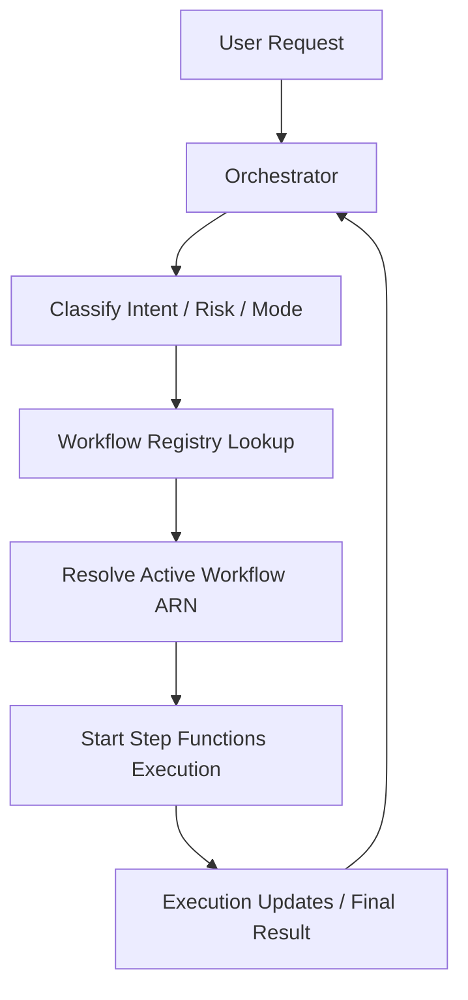
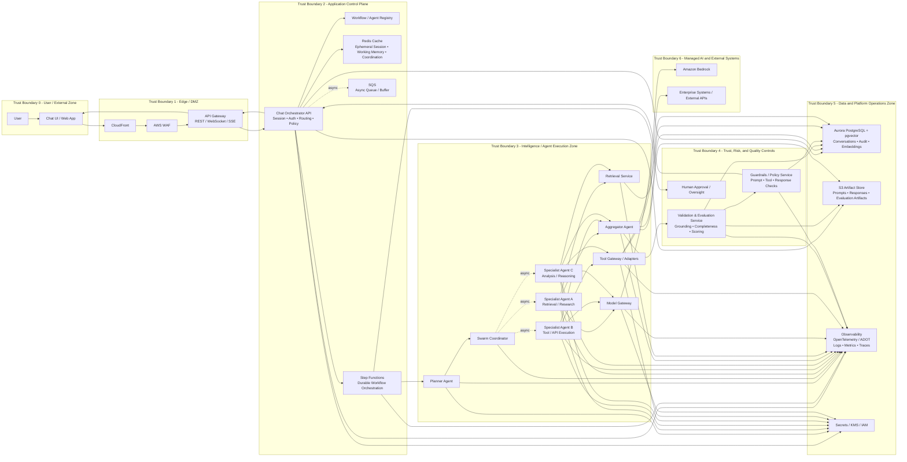
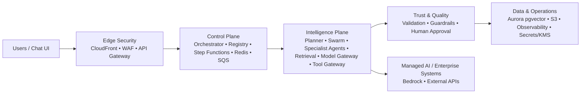

# Agent-Giri
Agent Giri Brother of Siri
# Architecture Flow

## Simple request
1. User prompt enters through API Gateway
2. Orchestrator classifies request
3. Step Functions starts a simple workflow
4. Retrieval and model gateway run
5. Validation/evaluation checks output
6. Guardrails checks policy/safety
7. Response is persisted and returned
## Complex multi-task request
1. User prompt enters through API Gateway
2. Orchestrator routes to a swarm-enabled workflow
3. Step Functions invokes planner
4. Planner decomposes task
4. Swarm coordinator fans out subtasks
5. Specialist agents run in parallel
6. Aggregator combines results
7. Validation/evaluation checks completeness, grounding, consistency
8. Guardrails checks compliance/policy
9. Human approval is triggered if needed
10. Final answer is stored and returned

# Recommended specialist agent types

You do not need too many at first. Start with 4 roles:

1. Planner Agent
2. Retrieval Specialist
3. Tool Specialist
4. Analysis Specialist
5. Aggregator Agent
6. Validation/Evaluation Service

That is enough to support swarm without turning the design into chaos.

## simple flow

# Enterprise Architecture with trust boundaries

Enterprise interaction patterns
1) Synchronous path

Used for:

simple chat request
direct RAG
low-latency response

Path:

UI -> API Gateway -> Orchestrator
Orchestrator may invoke a small workflow or route directly
final answer still goes through validation/guardrails
response streamed back
2) Asynchronous path

Used for:

long-running agent workflows
multi-agent swarm tasks
tool-heavy flows
approval-required tasks

Path:

Orchestrator -> Step Functions
Step Functions -> swarm / specialists
aggregation -> validation -> guardrails
final persisted result -> streamed/polled to UI

3) Human-in-the-loop path

Used for:

high-risk recommendations
actions against downstream systems
policy-sensitive output

Path:

Step Functions pauses
approval task is triggered
upon approval/rejection workflow resumes

Recommended trust-boundary rules

Here are the rules I would apply to each boundary.

Between Z1 and Z2

Only API Gateway should call the Orchestrator API.
No direct external traffic to agent services.

Between Z2 and Z3

Only approved workflow-triggered or orchestrator-approved calls should enter the agent zone.
Do not let agents be called directly from the UI.

Between Z3 and Z4

All aggregated outputs must pass through validation/evaluation and guardrails before returning to the user or downstream systems.

Between Z3 and Z6

Agents should never call external APIs directly.
All external calls should go through the Tool Gateway or Model Gateway.

Between all zones and Z5

Aurora is the durable source of truth.
Redis is ephemeral only.
Secrets should be fetched through approved IAM paths only.

# Exec version

# 1. External / User Zone
+--------------------------------------------------+
|            External / User Zone                  |
|--------------------------------------------------|
|  [ User ]  →  [ Chat UI / Web App ]              |
+--------------------------------------------------+

# 2. Edge /DMZ Zone
+--------------------------------------------------+
|            Edge / DMZ Zone                       |
|--------------------------------------------------|
|  [ CloudFront ] → [ AWS WAF ] → [ API Gateway ]  |
|                     (REST / WebSocket / SSE)     |
+--------------------------------------------------+

# 3. Application Control Plane
+-----------------------------------------------------------------------------------+
|                  Application Control Plane                                         |
|-----------------------------------------------------------------------------------|
|                                                                                   |
|  [ Chat Orchestrator API ]                                                        |
|   - Session Management                                                            |
|   - Auth / Identity Context                                                       |
|   - Prompt Routing                                                                |
|   - Policy Pre-check                                                              |
|                                                                                   |
|  [ Workflow / Agent Registry ]                                                    |
|   - Workflow mapping                                                              |
|   - Versioning                                                                    |
|                                                                                   |
|  [ Step Functions ]                                                               |
|   - Durable orchestration                                                         |
|   - Retry / branching / audit                                                     |
|                                                                                   |
|  [ SQS ]                                                                          |
|   - Async buffer                                                                  |
|                                                                                   |
|  [ Redis Cache ]                                                                  |
|   - Ephemeral session                                                             |
|   - Working memory                                                                |
|   - Coordination                                                                  |
|                                                                                   |
+-----------------------------------------------------------------------------------+

# 4. Intelligence / Agent Execution Zone
+--------------------------------------------------------------------------------------------------+
|                 Intelligence / Agent Execution Zone                                               |
|--------------------------------------------------------------------------------------------------|
|                                                                                                  |
|  ┌────────────────────────────┐        ┌────────────────────────────┐                            |
|  |       Planner Agent        | -----> |     Swarm Coordinator       |                            |
|  └────────────────────────────┘        └───────────────┬────────────┘                            |
|                                                      /     |       \                              |
|                                                     /      |        \                             |
|                                                    v       v         v                            |
|                                          ┌────────────┐ ┌────────────┐ ┌────────────┐            |
|                                          | Specialist | | Specialist | | Specialist |            |
|                                          | Agent A    | | Agent B    | | Agent C    |            |
|                                          | (Retrieval)| | (Tools)    | | (Analysis) |            |
|                                          └─────┬──────┘ └─────┬──────┘ └─────┬──────┘            |
|                                                |              |              |                   |
|                                                v              v              v                   |
|                                       ┌──────────────┐  ┌──────────────┐                         |
|                                       | Retrieval     |  | Tool Gateway |                         |
|                                       | Service       |  | / Adapters   |                         |
|                                       └──────┬───────┘  └──────┬───────┘                         |
|                                              |                 |                                 |
|                                              v                 v                                 |
|                                         ┌────────────────────────────┐                           |
|                                         |     Model Gateway           |                           |
|                                         |  (LLM Routing / Control)    |                           |
|                                         └────────────────────────────┘                           |
|                                                                                                  |
|                                 ┌────────────────────────────┐                                   |
|                                 |     Aggregator Agent        |                                   |
|                                 |  (Merge + Resolve Output)   |                                   |
|                                 └────────────────────────────┘                                   |
|                                                                                                  |
+--------------------------------------------------------------------------------------------------+

# 5. Trust, Risk and Quality Layer

+----------------------------------------------------------------------------------+
|              Trust, Risk, and Quality Layer                                      |
|----------------------------------------------------------------------------------|
|                                                                                  |
|  [ Validation & Evaluation Service ]                                             |
|   - Grounding check                                                              |
|   - Completeness                                                                 |
|   - Scoring / confidence                                                         |
|                                                                                  |
|  [ Guardrails / Policy Service ]                                                 |
|   - Prompt filtering                                                             |
|   - Tool restrictions                                                           |
|   - Output safety                                                                |
|                                                                                  |
|  [ Human Approval ]                                                              |
|   - High-risk workflows                                                          |
|   - Compliance review                                                            |
|                                                                                  |
+----------------------------------------------------------------------------------+

# 6. Data and Operations Zone

+--------------------------------------------------------------------------------------+
|                    Data and Platform Operations Zone                                 |
|--------------------------------------------------------------------------------------|
|                                                                                      |
|  [ Aurora PostgreSQL + pgvector ]                                                    |
|   - Conversations                                                                   |
|   - Audit trail                                                                     |
|   - Embeddings                                                                      |
|                                                                                      |
|  [ S3 Artifact Store ]                                                               |
|   - Prompt/response archives                                                        |
|   - Evaluation outputs                                                              |
|                                                                                      |
|  [ Observability (ADOT) ]                                                            |
|   - Logs                                                                            |
|   - Metrics                                                                         |
|   - Traces                                                                          |
|                                                                                      |
|  [ Secrets Manager / KMS / IAM ]                                                     |
|   - Credentials                                                                     |
|   - Encryption                                                                      |
|                                                                                      |
+--------------------------------------------------------------------------------------+

# 7. External / Managed Services
+--------------------------------------------------------------+
|        Managed AI and External Systems                       |
|--------------------------------------------------------------|
|                                                              |
|  [ Amazon Bedrock ]                                          |
|   - LLM inference                                            |
|                                                              |
|  [ External APIs / Enterprise Systems ]                       |
|   - Market data                                              |
|   - Internal services                                        |
|                                                              |
+--------------------------------------------------------------+

##Prompt for VSCode
You are an expert AWS Solutions Architect helping design and refine a **generic, infrastructure-centric platform architecture** for a Capital Markets organization.

## Context

We are an **infrastructure/platform team** responsible for:

* provisioning shared AWS infrastructure
* defining reusable architecture patterns
* enabling application teams to build and deploy quickly
* supporting modern workloads including **GenAI / LLM use cases**

We do NOT own:

* business logic
* domain workflows
* application-specific APIs

---

## Architecture Scope

The platform includes:

### Multi-Account Setup

* **Shared Ingress Account**

  * AWS WAF
  * API Gateway

* **Shared Platform / Workload Account**

  * VPC with segmented subnets:

    * Ingress/Public
    * Private Application
    * Data Layer
    * VPC Endpoint subnets

---

### Core Layers

1. **Client / Access Layer**

   * Clients → WAF → API Gateway

2. **Application Runtime Layer**

   * ECS services (APIs, workers, integration services)
   * Inference services (Bedrock or ECS-hosted)

3. **Messaging Layer**

   * Amazon SQS

4. **Data & State Layer**

   * RDS
   * Redis (ElastiCache)
   * S3
   * **Vector Store (OpenSearch / pgvector)**

5. **Platform Operations Layer**

   * CloudWatch
   * OpenTelemetry
   * Secrets Manager
   * KMS
   * IAM
   * VPC / networking

---

### Networking Model

* All workloads run in **private subnets**
* Use **VPC Interface Endpoints (PrivateLink)** for:

  * Secrets Manager
  * KMS
  * SQS
  * Bedrock
* Applications call AWS services via SDK
* Traffic is automatically routed through endpoints via **Private DNS**

---

### GenAI / Vector Architecture

* ECS services orchestrate:

  * embedding generation
  * vector storage
  * retrieval (RAG)
  * LLM inference

* Default approach:

  * **Bedrock for embeddings + LLM**

* Advanced:

  * ECS-hosted inference services

---

### Developer Enablement Layer

We also provide reusable assets:

* Docker templates (API, worker, streaming)
* CI/CD pipeline blueprints
* Terraform/CDK modules
* Integration service examples (internal APIs)
* Streaming / LLM examples
* RAG / vector reference patterns
* Sample applications and local dev setups

This enables **rapid experimentation (“vibe coding”)**

---

### Stack Separation

**Platform Stack Group**

* Network, security, ingress, messaging, shared data, observability

**Application Stack Group**

* ECS services, APIs, workers, integrations, inference, app data access

---

## Key Design Questions to Support

Help refine and extend this architecture by:

* improving diagram clarity and structure
* validating AWS best practices
* suggesting enhancements for:

  * security
  * scalability
  * GenAI workloads
* explaining trade-offs (e.g., Bedrock vs ECS inference)
* refining networking (VPC endpoints, private access)
* improving developer enablement patterns

---

## Important Constraints

* Keep everything **generic and reusable**
* Avoid use-case-specific logic
* Focus on **platform capabilities**
* Keep explanations **clear and executive-friendly**

---

## Goal

Act as a senior architect and help:

* refine the architecture
* improve diagrams
* validate design decisions
* prepare executive-level explanations
